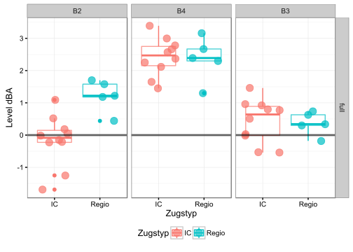
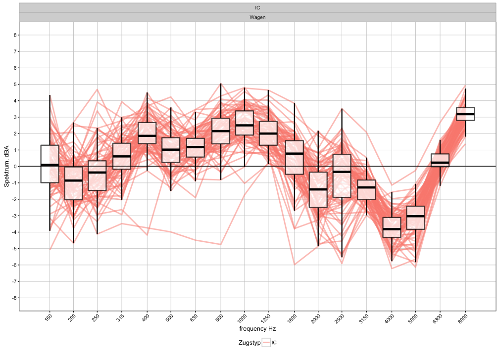
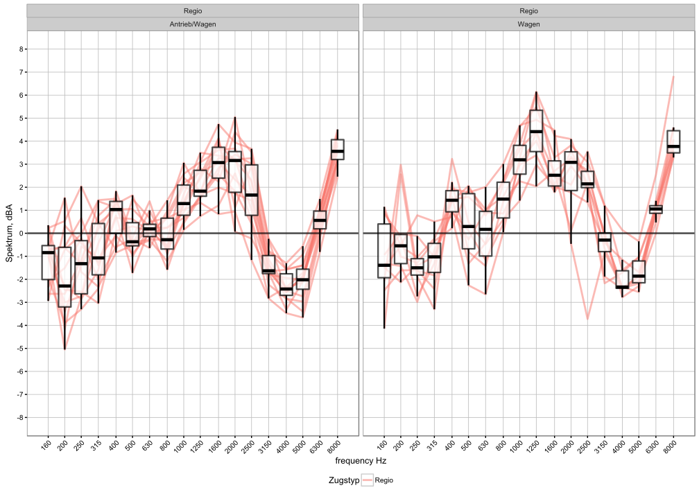
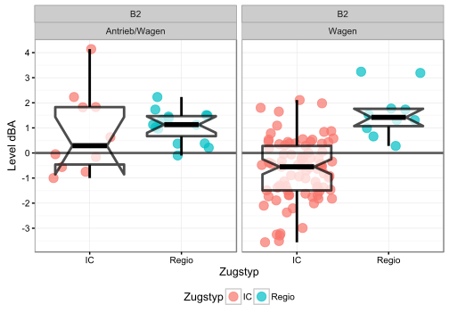

# Dämpferwirkung
ESR  
21. Januar 2016  

# Schalldruckpegel Differenzen mit Referenzabschnitt

In Dieser Abschnitt werden die Differenzen der Spektren bzw. Levels zwischen  Referenzabschnitt und Dämpferabschnitt untersucht. Ziel ist die dämpferwirkung Abzuschätzen.

**Eine positive Differenz deutet auf eine positive Wirkung der Dämpfern*

## Differenz von Gesamtzugauswertung: alle Abschnitte

Die Differenzen von auswertungsintervall `full` sind für alle Abschnitte vorhanden und werden hier gezeigt

### Spektral

### Levels

## Differenzen Wagenweise: Wagen , Trieb/Wagen: Abschnitt B2

Für den Abschnitt B2 ist es zusätzlich möglich die Differenzen je Auswertungsintervall `n` (je doppel Drehgestell) zu berechnen. Die Resultierende Wirkung sind die Folgende:

### Spektral

#### IC Züghe

#### Regio

### Levels

##  Gemessne Wirkung  von Schinendämpfer in dBA

Die Indikatoren

 - mittelwert `av`
 - median `me`
 - Quantilen `Q25` und `Q75`
 - und Standardabweichung
 
 sind in die untere Tabellen für verschiedene Kombinationen aus Verkehr und Dämpfern berechnet.

####  Wirkung nach Dämpfertyp, Zugstyp und Drehgestelltyp
 Berechung für jede Kombination aus Dämpfertyp(Abschnitt), Zugstyp und Drehgestelltyp(Interval Kategorie) 
<!--html_preserve-->

<!--/html_preserve-->

####  Wirkung nach Dämpfertyp und Zugstyp
 Berechung für jede Kombination aus Dämpfertyp(Abschnitt) und  Zugstyp
 
<!--html_preserve-->

<!--/html_preserve-->
