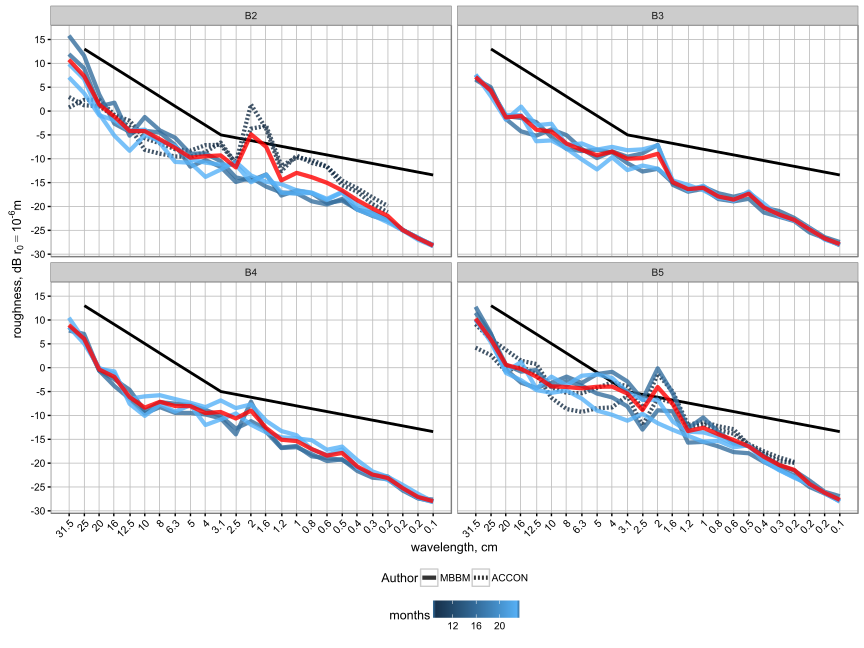
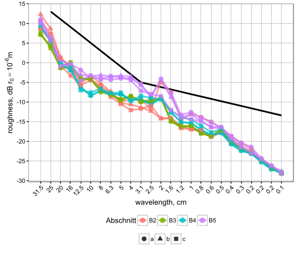
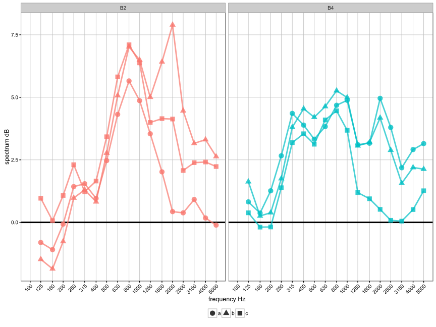

-   Schienenrauheit (SR) in Niederwangen
    -   Darstellung der gemessenen SR Spektren
-   Korrektur von Schalldruck Spektren
    -   Auswahl einer representative SR fur Schallspektren korrekturen
    -   Korrektur Bilden

Schienenrauheit (SR) in Niederwangen
------------------------------------

In Niederwangen wurden im November-2013 die Schienen geschliffen. Danach
wurde der Zustand der SR mehrmals von MBBM und ACCON gemessen. Folgende
Messkampagne wurden durchgeführt:

-   MBBM hat 4 mal alle Abschnitten gemessen
-   ACCON hat Abschnitt B5 und B2 einmal gemessen

Zur MBBM Messkampagnen sind detallierte Berichte zur Verfügung. Die
Versuchsanordnung in Niederwangen ist [hier]() Beschrieben.

<table>
<thead>
<tr class="header">
<th align="left">Messbüro</th>
<th align="left">Messkampagne</th>
<th align="left">Messdatum</th>
</tr>
</thead>
<tbody>
<tr class="odd">
<td align="left">MBBM</td>
<td align="left">1</td>
<td align="left">März-2014</td>
</tr>
<tr class="even">
<td align="left">MBBM</td>
<td align="left">2</td>
<td align="left">Oktober-2014</td>
</tr>
<tr class="odd">
<td align="left">MBBM</td>
<td align="left">3</td>
<td align="left">März-2015</td>
</tr>
<tr class="even">
<td align="left">MBBM</td>
<td align="left">4</td>
<td align="left">Oktober-2015</td>
</tr>
<tr class="odd">
<td align="left">ACCON</td>
<td align="left">1</td>
<td align="left">Juli-2014</td>
</tr>
</tbody>
</table>

### Darstellung der gemessenen SR Spektren

**Diskussion:**

-   SR und Radrauhiet bilden zusammen die grundanregung von
    Rollgeräusch. Solange die SR wit unten TSI kurve (schwarze Kurve)
    liegt ist anzunehmen dass die Radrauheit verantwortlich fur die
    Anregung ist. In Niederwangen ist dass den fall für die meistens
    Wellenlängen. Für Wellellängen im bereich von 1.6-4 cm ist aber
    umgekehrt. Da ist der anteil der SR relevant (wahrscheinlich auch
    dominant gegenüber Radrauheit). Den beweis dafür sind die gemessene
    Schalldruckspektern welches eine stark tonale komponente bei 2000Hz
    aufweisen (alle Abschnitte). Diese Tonale komponente entspricht bei
    130 km/h ungefähr die 2 cm Wellenlänghe. Im folgende kapitel sind
    die SR speziell bei die 1.6-4cm Wellenlängen zu betrachten.

-   Die SR haben eine Spitze bei 2cm und 1.6 cm Welleänghe. Die
    Rauhigkeit bei 2 cm ist durch das Schleifvorgang bedingt. Das is ein
    bekanntes effekt deren Tiefe und genaue Wellenlänge vom
    unterschiedliche schleifparameter(korngrösse der schleifsteine,
    geschwindigkeit , maschine) abhängen.

-   Diese Spitze ist in jedem Abschnitt zu shehen und nimmt ab mit der
    Zeit ab. Die abnahme ist unterschiedlich von Abschnitt zu Abschnitt.
    Diese Abnahme ist vile kleiner als erwartet. 2 Jahren später ist
    immer noch eine klare Schleifrauheit zu sehen.

-   ACCON und MBBM messen die Spitze unterschiedlich. Diese unterschiede
    sind vorallem in Abschnitt B2 zu sehen. ACCON miss eine grössere
    verbleibende Schleifrauhigkeit als MBBM.

-   Die Schallmessung weist für alle Abschnitte eine starke tonalität
    auf. Das entspricht nicht mit die kürzlich gemessene SR wo nur
    referenz das aufweisen hätten sollte.

-   Die SR ist der resultat von der auswertung und mittelung meherere
    1-m Abschnitte in längsrichtung(detallierte MBBM berichte für mehr
    informationen). Die variation zwischen die 1-m abschnitte ist
    unbekannt.

-   Die SR bezihen sich auf die Fahrspiegelmitte.Eine variation in
    transversale richtung ist auch zuerwarten. Es ist zu bemerken dass
    die Radposition jedes drehgestell abwichen kann von dieser mitte.
    Konsequenz ist dass jedes Drehgestell spürt eine andere SR.

------------------------------------------------------------------------

Korrektur von Schalldruck Spektren
----------------------------------

In Niederwangen werden Schalldruckspektern von mehrere Abschnitte
miteinander vergliechen. Genauer wird die Differenz zwischen Refernz und
Dämpferabschnitt gebildet um die Schienendämpferwirkung abzuschätzen. Da
diese Abschnitte unterschiedliche SR aufweisen könnten ist kann die
gebildete Differenz mithilfe die SR differenzen^korrigiert werden.

Die erzeugung einer SR korrektur fur die Schalldruckspektern in 2
Schritte

1.  Auswahl einer representative SR für jeden Abschnitt
2.  Schalldruckpegelkorrektur bilden

### Auswahl einer representative SR fur Schallspektren korrekturen

Als erstens eine Bemerkung. Da die Schallspektren 2000Hz sptze aufweisen
ist die SR vorallem bei 2cm Wellenlänge zu betrachten.

Als logischere Ansatz würde man die kürzlich zur Schallmessung gemessene
SR werwenden, d.h MBBM Messkampagne 4 Es gibt Gründe andere
Messkampagnen einzubezihen für die representative SR.

-   Abnahme der schleifrauhigkeit ist klein, d.h. vorletzte SR
    messkampagne könnte auch noch representativ sein
-   Will man ACCON werte verwenden (auch noch relativ kürzlich zur
    Schallmessung)
-   Messkampagne 4 weist nicht bei alle abschnitte höhe SR Werte bei 2
    cm. das ist inkonsistent mit 2000Hz Spitze gemessen beim
    Schallspektren.
-   variabilität der SR scheint gross zu sein. Ein Mittelwert schein
    geeigneter zu sein

Als Floge dieser Überlegungen untersuchen wir die folgnede 3 Fälle um
eine representative SR zu definieren:

1.  ACCON Messkampagne 1 MBBM Messkampagne 3 und MBBM Messkampagne 4
2.  MBBM Messkampagne 3 und MBBM Messkampagne 4
3.  MBBM Messkampagne 4. Aufgrund der Messdatum das sollte die
    realistische SR sein

Mehrere SR Spektren können in einem einzelen gemittelte Spektrum
zusammengefasst werden. Die Mittelung erfolgt je Band Energetisch.

In den nächsten Bild ist den Beispiel für den fall a.

#### Representative SR im Vergleich

Im nächsten bild ist den vergleich für die drei Fälle der representative
SR zu sehen.

> Es ist zu sehen dass die gemittelte SR werte viel streuen. Die
> Streuung betragt beim 2cm und 1.6 cm Wellenlänghe bis zu 10dB. Dieser
> Streuung wird grosseKonsequenzen auf die Korrekturen von Schalldruchk
> Spektern haben. Wieter ist zu bemerken dass der Referenz Abschnitt der
> mit grössere SR ist. Es ist also allein vom SR zu erwarten dass diesem
> Abschnitt lauter sein wird.

### Korrektur Bilden

Das vorgehen um Schllspektren korrekturen aufgrund von Gesamtrauheiten
differenzen ist das Folgende:

1.  Umwandeln der Gesamtrauheit von Wellenlänghe zur Frequenz Hz:
    -   $R\_{tot,B}(f = \\frac{v}{\\lambda}) = R\_{tot,B}(\\lambda)$
    -   lineare interpolation um die Werte bei der gewünschte frequenz
        zu bekommen

2.  Definiere Korrektur Filter bezüglich Referenzabschnitt:
    *K**o**r**r**B*(*f*) =  − Δ*R**t**o**t*, *B*(*f*) =  − (*R**t**o**t*, *B*(*f*) − *R**t**o**t*, *B*5(*f*))

3.  Korrigierte Spektrum für jede Abschnitt Berechnen:

*S**B*(*f*) = *S**B*(*f*) + *K**o**r**r**B*(*f*)

Die **Gesamtrauheit** (Schiene + Rad) ist meist notwendig um diese
Korrekturen durchzuführen. In unseren Messsetup ist die Schienenrauheit
bei 2 cm sehr hoch und die Spektren zeigen den grossen anteil der
Energie bei der resultierende Frequenz. Damit kann man zumindestns für
die 2cm Wellenlänghe annehmen dass
*R**t**o**t*, *B* ≈ *S**R**B* und die Schalldruk
Korrekturen mit der SR durchführen.

#### Beispiel: 130*k**m*/*h*

Fur eine Geschwindigkeit von 130 *k**m*/*h* bekommt man fur die
Abschnitten B2 und B4 die folgende Schallspektren Korrekturen:

**Diskussion: **

-   Die korrektur beim 2000 Hz streut sehr viel und ist in der
    Grossenordnung von 0.5-7dB fur den Abschnitt B2 und 0.5-4.5dB für
    den Abschnitt B4. Diese Korrekturen sind viel grösser als erwartet
    und scheinen wenig plausibel zu sein

-   Die Korrekturen sind positiv das heisst die Abschnitte sollten
    lauter sein wenn die SR wie beim Referenz Abschnitt B5 wäre. Diese
    korrekturen haben zur Folge dass die Dämpferwirkung kleiner wird
    oder sogar negativ.

-   die unteschiedliche Falle scheinen ein zufälliger verhalten zu haben

**Aufgrund dieser Diskussion wird Verzichtet die korrekturen auf die
Spektren Anzuwenden**
